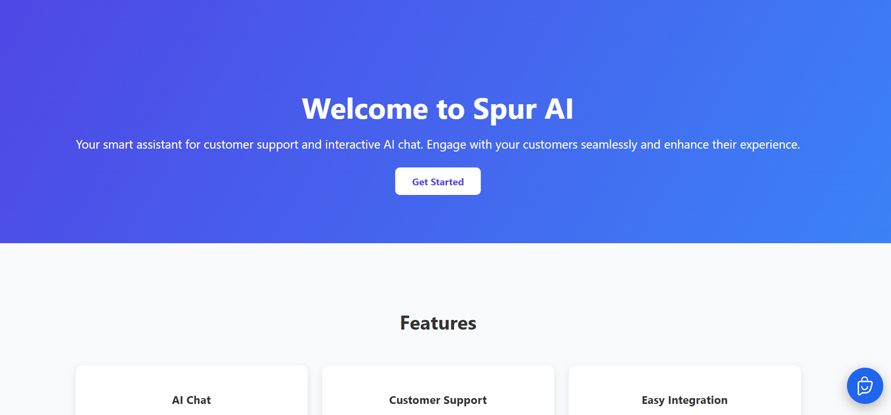
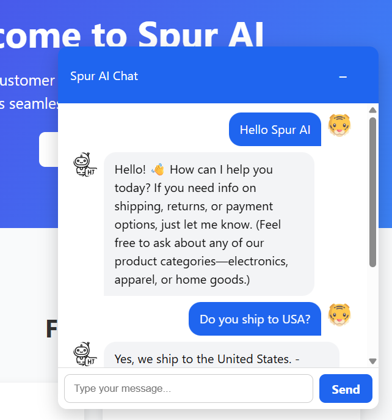
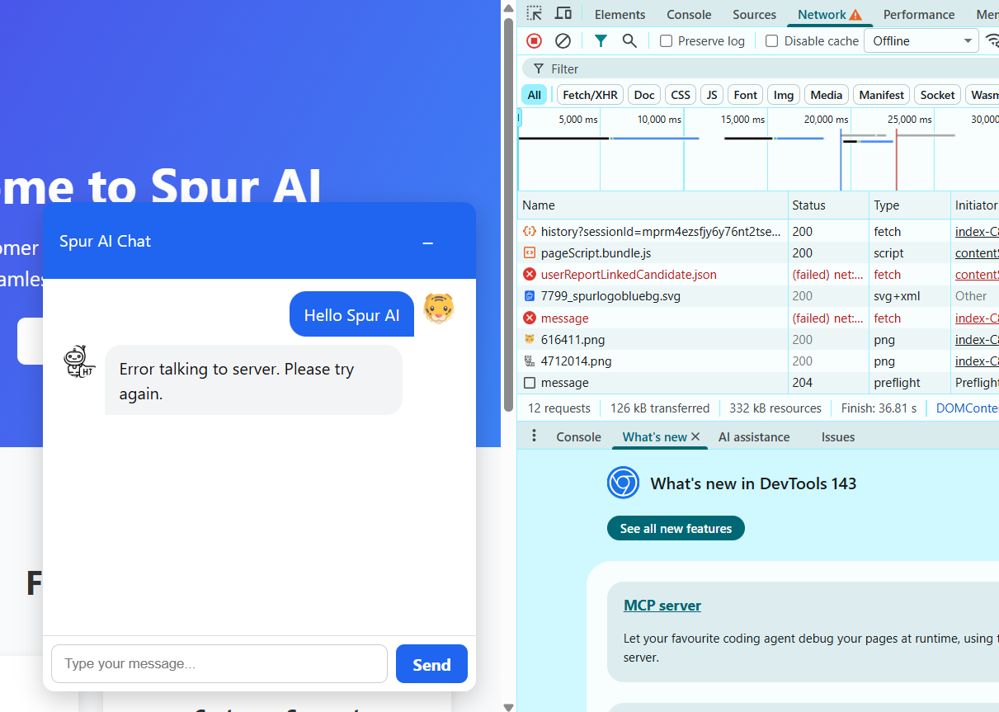

# Spur AI Live Chat

A mini AI customer support chat app built as a take-home project for Spur.  
The AI responds to user messages using OpenAI GPT and persists conversation history.

**Live Demo:** [https://spur-ai-live-chat-1.onrender.com/](https://spur-ai-live-chat-1.onrender.com/)  
**GitHub Repo:** [https://github.com/RaviTejaKaranam/spur-ai-live-chat](https://github.com/RaviTejaKaranam/spur-ai-live-chat)

---

## Features

- Simple live chat interface with clear distinction between user and AI messages
- Auto-scroll to latest message
- Disabled send button while request is in flight
- Typing indicator for AI
- Conversation history persisted per session
- Friendly error handling when server or AI fails

---

## Screenshots

**Landing Page**

**Chat in Action**

**Server Failure Testing**

---

## Tech Stack

- **Frontend:** React, TypeScript, Vite, CSS
- **Backend:** Node.js, Express, TypeScript
- **Database:** SQLite (via Prisma)
- **LLM:** OpenAI Groq
- **Hosting:** Render

---

## Getting Started

### 1. Clone the repository

- git clone [https://github.com/RaviTejaKaranam/spur-ai-live-chat](https://github.com/RaviTejaKaranam/spur-ai-live-chat)
- cd spur-ai-live-chat

### 2. Backend Setup

- cd backend
- npm install

**Create a .env file:**

- DATABASE_URL=file:./dev.db
- OPENAI_API_KEY=your_openai_api_key_here
- PORT=4000

**Run database migrations:**

- npx prisma migrate dev --name init

**Start the backend server:**

- npm run dev

### 3. Frontend Setup

- cd frontend
- npm install

**Create a .env file:**

- VITE_API_URL=http://localhost:4000/chat

**Start the frontend:**

- npm run dev
- Visit http://localhost:5173 to see the app.

### Architecture Overview

**Backend**

- app.ts → Express app setup
- server.ts → Entry point
- controllers/chat.controller.ts → Handles API requests
- services/chat.service.ts → Business logic, handles messages, AI calls
- services/llm.service.ts → Wraps OpenAI API call
- repositories/conversation.repository.ts → Handles conversation persistence
- repositories/message.repository.ts → Handles message persistence

**Frontend**

- components/ChatWidget.tsx → Main chat widget UI with auto-scroll, input, messages
- ChatWidget.css → Styling for chat widget

### LLM Integration Notes

- Provider: Groq
- Model: openai/gpt-oss-20b
- System Prompt: "You are a helpful support agent for a small e-commerce store. Answer clearly and concisely. FAQs:
  - Shipping: 2-5 business days
  - Returns: 30-day refund policy
  - Support hours: 9am-6pm Mon-Fri
  - Products: electronics, apparel, home goods
  - Provide links to relevant help articles when appropriate.
  - Support payments via credit card, PayPal, and Apple Pay."

### Trade-offs & If I Had More Time

- SQLite is ephemeral on Render; switching to Postgres would persist data across deploys
- No authentication implemented
- Frontend could include better UX animations, timestamps for messages
- Could add richer AI prompts or FAQ management stored in DB
